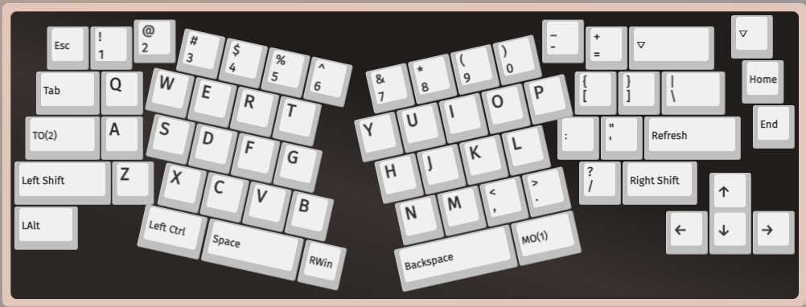
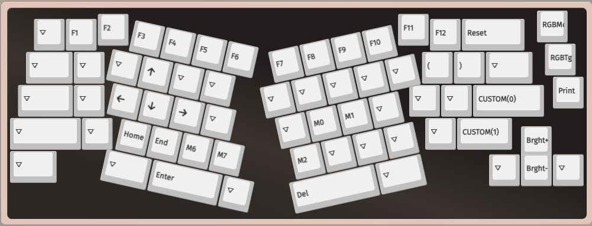
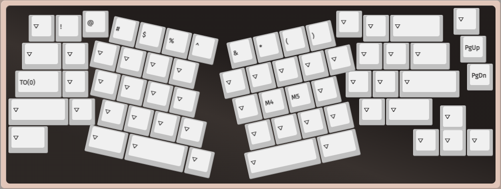

# Mech Keyboard VIA Layouts

## FancyAlice 66

VIA layout for FancyAlice 66. Mech keyboard with 66 keys, 65% layout, currently using 3 / ? layers.

[Layout File](fancyalice66.layout.json)

### Layers
#### Layer 0

#### Layer 1

#### Layer 2

#### Layer 3

TBD

### Macros

M0: Ctrl + Left -> Change to left workspace in Mac

M1: Ctrl + Right -> Change to right workspace in Mac

M2: ñ

M3: {KC_LSFT,KC_LGUI,KC_S} -> Screenshot on Win

M4: RWin + Alt + Left -> Move to left browser tab

M5: RWin + Alt + Right -> Move to right browser tab

M6: {KC_LGUI,KC_LSFT,KC_LCTL,KC_4} -> Copy portion of screen into clipboard (Mac)

M7: {KC_LGUI,KC_LSFT,KC_4} -> Capture portion of screen into Preview (Mac)
